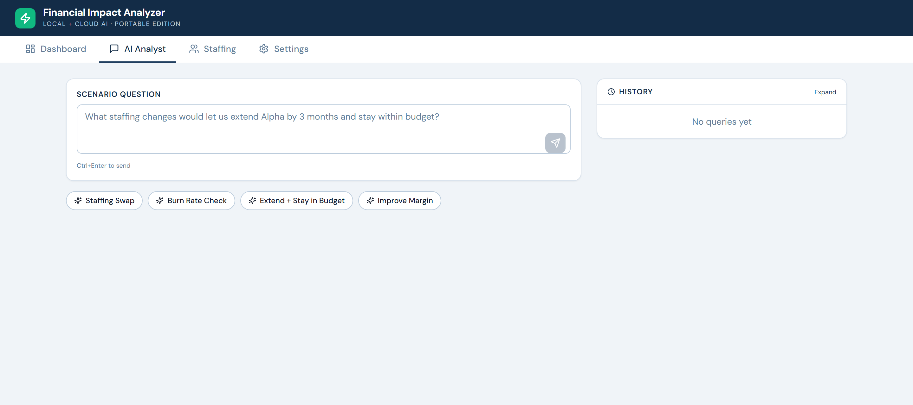

# Financial Scenario Engine

[](https://github.com/tafreeman/financial-scenario-engine/actions/workflows/deploy-pages.yml)
[](LICENSE)

**📖 Live docs:** [https://tafreeman.github.io/financial-scenario-engine/](https://tafreeman.github.io/financial-scenario-engine/)

A local TypeScript financial scenario simulator built on the principle that **financial math must be deterministic and auditable**. The calculation engine in `server/engine/` produces every number — the LLM only parses natural-language intent and optionally narrates results, and any structured output it returns is revalidated against a strict schema at that trust boundary before the engine ever sees it (see [Reliability at the LLM boundary](#reliability-at-the-llm-boundary)). All project data lives in a local SQLite file; inference runs via a multi-provider abstraction over the GitHub Models API or fully offline via Ollama, with no external cloud dependency required.

> **Development note:** Built with AI-assisted development; see [`CONTRIBUTORS.md`](CONTRIBUTORS.md) for tooling and attribution details.

## What It Does

PMs can ask natural-language questions and get structured financial analysis backed by live project data:

- **Staffing swap analysis** — "What if we replace the Senior Dev with two Mid-level Devs?"
- **Burn rate monitoring** — "Flag projects that will exhaust budget within 3 months"
- **Pre/post bid comparison** — "Compare original bid against current actuals"
- **Margin analysis** — "Which labor categories are dragging margin down?"

### AI Analyst Tab



## Architecture

```
┌─────────────────────────────────────────────────┐
│ Browser UI                                      │
│ React 19 + Vite + Tailwind                      │
│ Dashboard │ AI Analyst │ Staffing │ Settings    │
└──────────────────┬──────────────────────────────┘
                   │ REST API
┌──────────────────┴──────────────────────────────┐
│ Express Server                                  │
│  routes.ts   db.ts   ai.ts   import/excel/      │
│                      │                           │
│                      ▼                           │
│             server/engine/                      │
│     deterministic financial calculations        │
└───────────────┬───────────────────────┬─────────┘
                │                       │
                ▼                       ▼
      Local SQLite data           Optional LLM provider
        data/finimpact.db         GitHub Models or Ollama
```

### Reliability at the LLM boundary

The LLM sits at the edge, not in the critical path, and every call across that boundary is hardened:

- **Transient-failure retry policy** — bounded retries (`LLM_MAX_RETRY_ATTEMPTS = 3`) with exponential backoff + jitter, honoring a server `Retry-After` header capped at 60s so a hostile or buggy header can't stall a request for minutes (`chatRequest()`, `server/ai.ts`).
- **Structured-output revalidation at the trust boundary** — every LLM response that becomes a `ScenarioOperation`, on both the V2 parse path and the V3 tool-call path, is revalidated against a strict Zod schema (`scenarioOperationSchema`) before the deterministic engine runs; malformed or hallucinated fields are rejected, not coerced (`server/engine/validation.ts`, `server/ai.ts`).
- **SSRF / redirect egress guards** — the config endpoint URL is rejected if it resolves to a loopback or private-range host, including IPv4-mapped/IPv4-compatible IPv6 forms that would otherwise bypass a naive check (`server/ssrf.ts`), and outbound LLM requests set `redirect: "error"` so an allowlisted endpoint can't 3xx-redirect the request (carrying the PAT and financial context) to an attacker-controlled host (`chatRequest()`, `server/ai.ts`).
- **Boundary observability** — every LLM call emits one structured JSON log line (request id, latency, retry count, prompt/completion token counts, typed failure code — never prompts, queries, or financial content; `server/logger.ts`, `server/ai.ts`) and updates an in-process aggregate served read-only at `GET /api/telemetry/llm` (`server/llm-telemetry.ts`). Nothing is transmitted anywhere — see Security below.

## Quick Start

### Prerequisites
- **Node.js 18+** — [download](https://nodejs.org/)
- **Optional:** GitHub PAT with `models:read` scope for AI-powered scenario analysis — [create one](https://github.com/settings/tokens?type=beta)
- **Optional:** Ollama for fully local inference

### Option A: Double-click (easiest)
1. Double-click `start.bat`
2. First run installs dependencies and builds (~2 min)
3. Browser opens to `http://127.0.0.1:3000`
4. Go to Settings → choose GitHub Models or Ollama
5. If using GitHub Models, paste your PAT and save

### Option B: Manual
```bash
npm run setup
npm run install:all
npm run build
npm start
```

### Option C: Development (hot reload)
```bash
npm run install:all
npm run dev
# Server: http://127.0.0.1:3000
# Client dev: http://localhost:5173 (proxies /api to 127.0.0.1:3000)
```

## AI Workflows

The app supports two AI-assisted flows:

1. **V2** — LLM parses intent, the deterministic engine computes results, and the app returns template or LLM narration
2. **V3** — a ReAct-style bounded tool-calling agent (`agenticScenario()`, `server/ai.ts`) that calls the `run_scenario` tool in a loop (capped at `MAX_ITERATIONS = 8`, with a final-summary fallback if it hits the cap) to explore one or more scenarios with exact engine outputs

Cloud LLM requests use a context-minimization step (`buildAnonymizedContextSnapshot()`, `server/db.ts`) that performs PII redaction before egress — person names are replaced with `Staff-N` before the snapshot ever leaves the machine.

### Scenario Pipeline (V2)

```
User query
   │
   ▼  (LLM — anonymized context)
parseIntent()  →  ScenarioOperation (structured JSON, revalidated against
                   scenarioOperationSchema before anything downstream trusts it)
   │
   ▼  (deterministic, no LLM)
executeScenario()  →  ScenarioResult (numbers + deltas)
   │
   ▼  (template-based by default; LLM optional)
generateNarrative()  →  Markdown prose
```

### LLM Providers

A single multi-provider abstraction (`getAiConfig()`, `server/ai.ts`) resolves model, endpoint, and credentials from the SQLite config table so the rest of the app (parsing, narration, the V3 agent loop, and the intent eval runner) never branches on provider directly:

| Provider | Config key `llm_provider` | Notes |
|----------|--------------------------|-------|
| GitHub Models API | `github` (default) | Requires PAT with `models:read` scope |
| Ollama (local) | `ollama` | No PAT needed; requires a running Ollama server |

Switch providers via the Settings tab or by editing `llm_provider` in the config table.

## Data

### Storage
All data lives in `data/finimpact.db` — a single SQLite file. Back up by copying this file.
Delete it to reset to sample data (auto-recreated on next startup).

### Sample Data (seeded on first run)
- 3 projects: Alpha ($1.25M), Beta ($2.1M), Gamma ($680K)
- 8 labor categories with bill/cost rates
- 8 staffing assignments across projects

### Excel workbook preview (read-only)
POST a `.xlsx` file to `/api/import/excel` or `/api/import/excel/v2`. The endpoints return sheet names plus the first 20 rows for up to 10 sheets — purely a preview surface. **No data is written to the database.** Full workbook-to-SQLite mapping is on the [roadmap](#roadmap), not in the current release.

## Security

- PAT stored in local SQLite only — never logged, never cached externally
- PAT transmitted exclusively to `models.github.ai` over HTTPS with TLS when the GitHub provider is selected
- Ollama mode keeps inference local to the machine
- No external telemetry, no analytics, and no external cloud dependency outside the selected LLM provider — the in-process LLM call metrics at `GET /api/telemetry/llm` (counts, latency, typed failure codes; never prompts or financial content) are served locally and transmitted nowhere
- Server binds to `127.0.0.1` by default — not accessible from other machines
- Local shared-secret auth boundary (`requireAppToken`, `server/auth.ts`) guards every mutating route (config writes, Excel import, staffing/project CRUD) behind an `x-app-token` header, compared with `crypto.timingSafeEqual` so the rejection time can't leak how much of the token matched — a co-located process without the secret can't repoint the LLM endpoint or write data
- For regulated environments: verify GitHub Models API data classification approval

### CORS configuration

The server defaults to allowing requests only from `http://127.0.0.1:3000` (the local dev origin). When deploying behind a reverse proxy or to a hosted environment, set the `CORS_ORIGIN` environment variable to your application's actual origin:

```bash
CORS_ORIGIN=https://your-app.example.com npm start
```

Leaving `CORS_ORIGIN` unset in production causes browsers to reject cross-origin requests from the production domain. The explicit origin requirement stops arbitrary pages in a user's browser from reading API data (including `/api/config`).

## Tech Stack

| Layer | Technology | Why |
|-------|-----------|-----|
| Runtime | Node.js 18+ | Portable, no compilation step |
| Server | Express + TypeScript | Minimal, well-known |
| Database | SQLite (better-sqlite3) | Zero-config, single file, portable |
| AI (cloud) | GitHub Models API | Approved toolchain, PAT auth, multi-model |
| AI (local) | Ollama | Fully offline alternative; no PAT required |
| Calc Engine | Pure TypeScript (`server/engine/`) | Deterministic, fully tested, no LLM dependency |
| Frontend | React 19 + Vite + Tailwind | Fast dev, small bundle |
| Markdown | react-markdown | Renders AI response tables and formatting |
| Excel | ExcelJS | Parse uploaded workbooks |

## Testing

### Unit Tests (Vitest)

Tests cover the financial calculation engine (`server/engine/`).

```bash
npm test                # same as vitest run
npx vitest run          # run once
npx vitest              # watch mode
```

The core calculation modules — `labor`, `budget`, `margin`, `evm`, `utilization`, `scenarios`, and `narrative` — each have a dedicated unit-test file exercising the full calculation surface (EVM metrics, utilization, what-if scenarios) with no network or API key. `matching.ts` (fuzzy project/role resolution) and `portfolio.ts` (portfolio aggregation) have no standalone test file of their own — they're exercised transitively wherever `executor.ts` resolves a project/role or aggregates a multi-project result (`executor-guards.test.ts`, `deterministic-asofdate.test.ts`, `evm-proxy.test.ts`, `scenarios.test.ts`). `validation.ts`'s Zod schema is covered by `validation.test.ts`. `goal-seeking.test.ts` is not a dedicated module's test file — there is no `goal-seeking.ts` module — it's a composability check that chains the `labor`/`margin`/`budget`/`scenarios` primitives the way the V3 agentic loop does to answer goal-seeking-style queries (e.g. "how do I extend the timeline and stay in budget?"). A separate AI-layer integration test covers the intent-to-tool-arg boundary.

**Coverage scope:** the enforced coverage thresholds ([`vitest.config.ts`](vitest.config.ts)) apply to `server/engine/**` — the deterministic financial core — and deliberately exclude `executor.ts`, `portfolio.ts`, and the barrel `index.ts`. That's not a coverage gap: `executor.ts`, and transitively `portfolio.ts`'s `calcPortfolioMetrics()` for portfolio-wide actions, is exercised directly by `executor-guards.test.ts`, `evm-proxy.test.ts`, and `deterministic-asofdate.test.ts`, which call `executeScenario()` the same way production does. **The Playwright E2E suite below does not additionally exercise this path** — the only E2E spec that reaches the AI-scenario endpoints (`ai-workflow.spec.ts`) intercepts the request at the browser network boundary (`page.route("**/api/scenario/v3", ...)`) and fulfills it with a scripted response, so `executeScenario()`/`calcPortfolioMetrics()` never run during that test; the e2e environment also has no LLM provider configured, so a live call isn't available as an alternative. The E2E suite's real (unmocked) coverage of `server/engine/` comes from the Dashboard tests in `app.spec.ts`, which hit the live `/api/dashboard` handler — though that handler computes its summary with its own arithmetic in `server/routes.ts` rather than calling `portfolio.ts`. Scoping the enforced numeric floor to the pure-calculation core keeps the gate meaningful rather than diluting it with orchestration code that unit tests are the better tool for.

### E2E Tests (Playwright)

```bash
npm run test:e2e
```

Playwright auto-builds the client and starts the app server on port `3100`.
On a fresh machine, install browser dependencies first:

```bash
npx playwright install --with-deps chromium
```

Tests live in `tests/e2e/ui/` (UI workflows) and `tests/e2e/excel/` (import endpoint).

`app.spec.ts` and `tests/e2e/excel/*.spec.ts` hit the real server and real (freshly-seeded) SQLite DB — no mocking. `ai-workflow.spec.ts` (the AI Analyst query/response flow) is different: it uses Playwright's `page.route()` to intercept `/api/scenario/v3` in the browser and return a scripted JSON response, so it verifies the *frontend's* handling of a given API shape (loading state, rendering, error states) — it does not exercise the real intent-parsing, engine, or narration code on the server. That's intentional: the e2e environment runs with no LLM provider configured (see `FSE_DISABLE_GH_TOKEN` in `playwright.config.ts`), so there's no live model to call. Server-side AI-boundary behavior is covered instead by the Vitest suite above (`ai.test.ts`, `executor-guards.test.ts`, etc.) and the separate intent-parsing eval below.

### Intent-parsing evals

The LLM boundary — user natural-language query → `ScenarioOperation` JSON — is covered by a separate eval corpus rather than the CI unit tests, because it requires a live model call.

**Corpus:** `server/evals/intent-corpus.json` — labeled cases spanning all 12 operation types (`swap`, `add`, `remove`, `rate_change`, `hours_change`, `timeline_extension`, `unexpected_cost`, `reallocation`, `burn_rate_check`, `margin_analysis`, `evm_analysis`, `what_if_composite`), plus ambiguous/out-of-scope queries with their expected fallback handling and an `adversarial` category (prompt-injection, contradictory, and trick queries). The exact case count is not repeated here — the size floor and category coverage are enforced by the corpus-integrity tests below. Where the prompt rules genuinely allow more than one valid interpretation, an entry may carry an `expectedAlternatives` array — the scorer accepts the best match among the primary expected value and its alternatives.

**Runner:**

```bash
GITHUB_TOKEN=<pat-with-models:read> npm run eval:intent
```

The runner sends each query through the same `PARSE_INTENT_PROMPT` (imported directly from `server/ai.ts`, so prompt edits flow into the eval automatically) and the same parse/fallback path that production uses — including the burn_rate_check fallback on unparseable model output. It scores exact action-type match and field-level match against the labeled expected values, and prints a per-case result table plus an aggregate accuracy summary. Both aggregate metrics (action accuracy and mean field score) use the full corpus size as denominator; transport errors score 0.

Notes on the runner's environment:
- Model, provider, and endpoint are resolved via the same `getAiConfig()` production uses (`server/ai.ts`), which reads the app's SQLite config table — a custom model/provider configured in Settings (or the seeded default, `openai/gpt-4.1` on the GitHub Models endpoint) is reflected in eval results, not hardcoded here.
- It still requires the `GITHUB_TOKEN` env var to be set even if your deployment is configured for Ollama or a DB-stored `github_pat` — the runner's upfront skip/gate check only looks at `process.env.GITHUB_TOKEN`, before `getAiConfig()` ever runs, so it exits before reaching the provider-aware resolution described above.
- If `GITHUB_TOKEN` is absent: an ungated local run (plain `npm run eval:intent`) exits cleanly without failing; a gated run (`EVAL_INTENT_GATED=1`, as set by `.github/workflows/real-model-eval.yml`) fails instead, so CI can't silently skip the accuracy gate.

**Results artifact:** `server/evals/results/latest.json` — written on each run, excluded from git. Accuracy is reported by the runner output and the results artifact; it is not hard-coded in this README.

**Corpus integrity (CI):** `server/__tests__/intent-corpus.test.ts` runs in the normal `npm test` suite — no network needed. It validates that every corpus entry is a structurally valid `ScenarioOperation`, all 12 action types are covered, ids are unique, the adversarial category is non-empty, and the corpus meets the size floor asserted there (the test is the authoritative number, not this README).

### Narration faithfulness (advisory judge)

A second, separate eval covers the outbound half of the LLM boundary: is the narrative generated for a scenario faithful to the deterministic `ScenarioResult` it describes (no invented or mismatched numbers, no direction flips, no unsupported claims)?

- **Judge:** `server/evals/faithfulness-judge.ts` — LLM-as-judge with a strict Zod-validated verdict schema and typed failure codes; the model call is injectable so its unit tests never touch the network. Eval-side only — never imported by production request-handling code.
- **Runner:** `GITHUB_TOKEN=<pat> npm run eval:faithfulness` — executes representative operations through the real `executeScenario()` → `generateNarrative()` path at a fixed reference date and judges each narrative. Results go to `server/evals/results/faithfulness-latest.json` (gitignored).
- **ADVISORY ONLY — this judge does not gate anything.** It has not been calibrated against human-labeled data, so its verdicts have no known precision/recall. The runner exits 0 regardless of verdicts; missing `GITHUB_TOKEN` skips cleanly (or fails under `EVAL_FAITHFULNESS_GATED=1`, mirroring the intent eval). A threshold may only be introduced by a deliberate calibration PR following the procedure documented in `server/evals/eval-config.ts`.

---

## Project Structure

```
financial-scenario-engine/
├── server/                     # Express + TypeScript backend
│   ├── index.ts                # Entry point, static file serving
│   ├── db.ts                   # SQLite schema, seed data, queries
│   ├── loaders.ts              # DB rows → PortfolioSnapshot for the engine
│   ├── ai.ts                   # LLM client (GitHub Models + Ollama) + prompts
│   ├── routes.ts               # REST API endpoints
│   ├── auth.ts                 # App-token auth (requireAppToken / APP_SECRET) for mutating routes
│   ├── ssrf.ts                 # SSRF guard helpers for config-endpoint URL refinements
│   ├── engine/                 # Financial calculation engine (pure functions)
│   │   ├── types.ts            # Shared types and constants
│   │   ├── labor.ts            # Labor cost/revenue metrics
│   │   ├── margin.ts           # Margin and profitability calculations
│   │   ├── budget.ts           # Burn rate and budget exhaustion
│   │   ├── evm.ts              # Earned Value Management (CPI, SPI, EAC, …)
│   │   ├── utilization.ts      # Utilization rate metrics
│   │   ├── scenarios.ts        # Staffing mutation functions (swap/add/remove)
│   │   ├── portfolio.ts        # Portfolio-level aggregation
│   │   ├── matching.ts         # Fuzzy role-name matching
│   │   ├── narrative.ts        # Template-based markdown narrative renderer
│   │   ├── validation.ts       # scenarioOperationSchema — Zod revalidation at the LLM trust boundary
│   │   ├── executor.ts         # Scenario orchestration (calc → impact; snapshot passed in)
│   │   ├── index.ts            # Barrel export
│   │   └── __tests__/          # Vitest engine unit tests (one file per module)
│   └── import/
│       └── excel/              # Excel workbook import module
│           ├── v1/             # V1 handler
│           ├── shared/         # Shared parser + types
│           └── index.ts        # Barrel export
├── client/                     # React + Vite + Tailwind frontend
│   └── src/
│       ├── App.tsx             # Shell with tab navigation
│       ├── api.ts              # Typed fetch client
│       ├── format.ts           # Number/currency formatting helpers
│       └── components/
│           ├── Dashboard.tsx   # Budget overview + stat cards
│           ├── Chat.tsx        # AI scenario query + history
│           ├── ScenarioCards.tsx # Structured scenario result display
│           ├── StaffingView.tsx # Staffing CRUD + rate card
│           └── SettingsPanel.tsx # PAT, model config, provider selection
├── tests/
│   └── e2e/                    # Playwright E2E tests
│       ├── ui/                 # UI workflow tests
│       └── excel/              # Excel import endpoint tests
├── data/                       # SQLite database (auto-created)
│   └── finimpact.db
├── start.bat                   # Windows one-click launcher
├── package.json                # Root deps (server + tooling)
├── vitest.config.ts            # Unit test config
├── playwright.config.ts        # E2E test config
└── README.md
```

## API Endpoints

| Method | Path | Description |
|--------|------|-------------|
| GET | `/api/health` | Health check |
| GET | `/api/telemetry/llm` | In-process LLM call metrics (counts, latency, typed failure codes — no content) |
| GET | `/api/dashboard` | Summary stats + project list |
| GET | `/api/projects` | Projects with burn rate calc |
| POST | `/api/projects` | Add project |
| PATCH | `/api/projects/:id` | Update project |
| GET | `/api/staffing` | Staffing (optional `?project_id=`) |
| POST | `/api/staffing` | Add staffing assignment |
| DELETE | `/api/staffing/:id` | Deactivate staffing |
| GET | `/api/rates` | Labor category rate card |
| POST | `/api/scenario/v2` | Run scenario: LLM intent → engine → narrative |
| POST | `/api/scenario/v2/parse-only` | Parse query to structured operation (no compute) |
| POST | `/api/scenario/v3` | Agentic scenario (tool-calling loop) |
| GET | `/api/scenarios` | Query history |
| GET | `/api/config` | Get config (PAT masked) |
| PUT | `/api/config` | Update config |
| POST | `/api/import/excel` | Upload Excel workbook — sheet preview only, no data written (v1) |
| POST | `/api/import/excel/v2` | Upload Excel workbook — sheet preview only, no data written (v2) |

## Customization

### Adding Labor Categories
Insert directly into SQLite:
```sql
INSERT INTO labor_categories (name, bill_rate, cost_rate)
VALUES ('Data Engineer', 205, 155);
```

### Changing the AI Behavior
Edit the prompt constants in `server/ai.ts`:
- `PARSE_INTENT_PROMPT`
- `NARRATE_PROMPT`
- `AGENTIC_SYSTEM_PROMPT`

These control parsing, narrative output, and agentic scenario behavior.

### Connecting to Real Data
Replace the seed data in `server/db.ts` → `seedSampleData()` with actual project/staffing data, or build an import pipeline from your pricing reference workbook.

---

## GitHub Pages Site

This repository includes a static **GitHub Pages** site built with the same React + Vite + Tailwind stack as the application UI.

### Pages Commands

```bash
npm run build:pages
cd client && npm run preview:pages
```

### Deployment

GitHub Pages deployment is automated in `.github/workflows/deploy-pages.yml`.
On pushes to `main`, GitHub Actions builds the static site and deploys the artifact from `client/dist-pages`.

---

## Roadmap

Forward-looking work that is **not** in the current release:

- **Full Excel-to-SQLite import.** Today's `/api/import/excel*` endpoints only return a preview (sheet names + first 20 rows for up to 10 sheets) and do not persist any data. Mapping previewed sheets onto the projects / staffing / labor schemas — including conflict resolution and column-mapping UI — is planned but not yet implemented.

## Further Reading

| Document | Description |
|----------|-------------|
| [`CONTRIBUTORS.md`](CONTRIBUTORS.md) | Authorship, AI tooling acknowledgement, and how to contribute |
| [`server/engine/README.md`](server/engine/README.md) | Calculation engine architecture, modules, and public API |
| [`client/README.md`](client/README.md) | React frontend setup, components, and build |
| [`server/import/excel/README.md`](server/import/excel/README.md) | Excel preview module — endpoint contracts and response shapes (preview only) |
