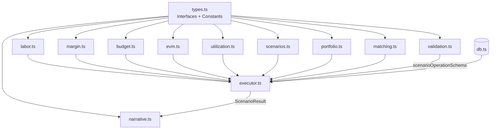

# Calculation Engine

The `server/engine/` directory contains the deterministic financial calculation engine. All modules are **pure functions** — no I/O, no side effects, no LLM calls.

## Architecture



## Design Principles

| Principle | Description |
|-----------|-------------|
| **Pure computation** | Calculation modules take explicit inputs and return explicit outputs |
| **Immutability** | Mutation functions return new arrays; never modify inputs |
| **Safe arithmetic** | `safeDivide()` prevents `Infinity`/`NaN` from propagating |
| **Determinism** | Same inputs always produce the same output |
| **AI separation** | Engine has no knowledge of LLM providers or prompts |

## Module Map

| Module | Purpose | Key export |
|--------|---------|------------|
| [`types.ts`](./types) | Interfaces + constants | All shared types |
| [`labor.ts`](./labor) | Labor cost/revenue | `calcProjectLabor()` |
| [`margin.ts`](./margin) | Profitability | `calcProjectMargin()` |
| [`budget.ts`](./budget) | Burn rate + exhaustion | `calcBudgetMetrics()` |
| [`evm.ts`](./evm) | Earned Value Management | `calcEvm()` |
| `utilization.ts` | Resource utilization | `calcUtilization()` |
| [`scenarios.ts`](./scenarios) | Staffing mutations | `applySwap()`, `calcScenarioImpact()` |
| [`portfolio.ts`](./portfolio) | Portfolio aggregation | `calcPortfolioMetrics()` |
| [`matching.ts`](./matching) | Fuzzy role matching | `fuzzyMatch()` |
| [`narrative.ts`](./narrative) | Template narratives | `generateNarrative()` |
| `validation.ts` | LLM trust-boundary schema | `scenarioOperationSchema` |
| [`executor.ts`](./executor) | Orchestration | `executeScenario()` |

> `utilization.ts` and `validation.ts` don't have a dedicated page in this guide yet (unlike the other modules above, which are linked) — see their doc comments in `server/engine/README.md` for now.

## Tests

```bash
# Run all engine tests
npx vitest run

# Watch mode
npx vitest
```

The current pass/fail and test-file count are whatever `npx vitest run` reports — not maintained as a static number here (it drifts every time a test is added).

| Test file | Covers |
|-----------|--------|
| `labor.test.ts` | `labor.ts` functions |
| `budget.test.ts` | `budget.ts` functions |
| `margin.test.ts` | `margin.ts` functions |
| `evm.test.ts` | `evm.ts` functions |
| `utilization.test.ts` | `utilization.ts` functions |
| `scenarios.test.ts` | `scenarios.ts` mutations + impact |
| `narrative.test.ts` | `narrative.ts` output |
| `validation.test.ts` | `validation.ts` — `scenarioOperationSchema` |
| `executor-guards.test.ts` | `executor.ts` guard paths — transitively exercises `matching.ts` and `portfolio.ts` |
| `evm-proxy.test.ts` | `executor.ts` — EVM proxy/spend-ratio wiring |
| `deterministic-asofdate.test.ts` | `executor.ts` — deterministic date handling |
| `goal-seeking.test.ts` | Not a per-module file — composes `labor`/`margin`/`budget`/`scenarios` to check goal-seeking-style what-if composability |
