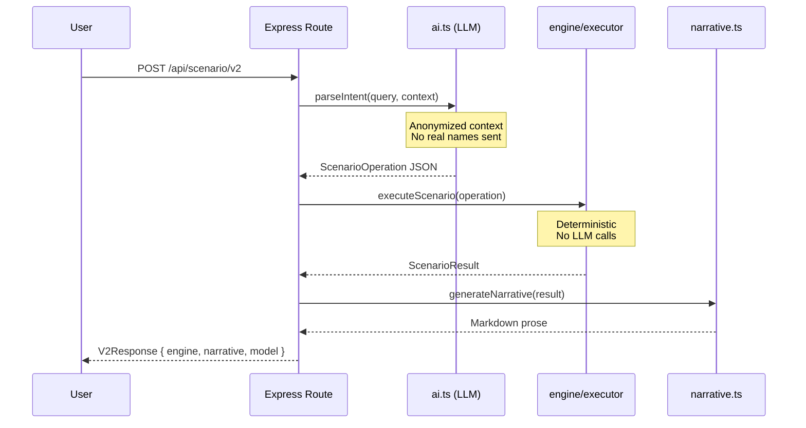
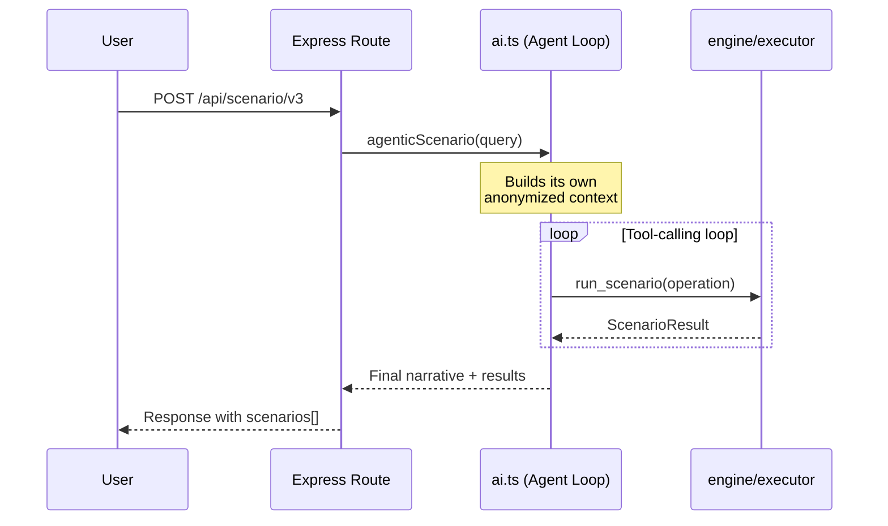

# AI Workflows

The app has two AI-assisted scenario analysis flows, plus a fully deterministic fallback.

In both flows the large language model (LLM) does the language work and nothing else: it reads your plain-English question and decides *what* to compute. The engine then does the computing. Every financial figure in a result is calculated by the engine, never by the model — though with model-written narration enabled the prose describing those figures is the model's own, which is what the advisory faithfulness judge checks.

## Scenario Pipeline (V2) {#v2}

The primary scenario path, and a single pass. The model turns your question into a structured operation, the engine computes the result, and the app renders a summary — from a fixed template by default, or from the model if you ask for it.



### Key Guarantees

- **Engine isolation** — `executeScenario()` never calls the LLM
- **Privacy** — Person names replaced with `Staff-N` before any cloud call
- **Determinism** — Same `ScenarioOperation` always produces the same `ScenarioResult`
- **Fallback narrative** — Template-based markdown when LLM narration is disabled

## Agentic Analysis (V3) {#v3}

V3 uses tool-calling: the model is given the engine as a callable tool (`run_scenario`) and decides for itself when to invoke it. That lets it work through several scenarios in one request — compute, read the exact engine numbers back, then decide what to try next — rather than committing to a single operation up front. Every number it reasons over still comes from the engine.



## Reliability at the LLM Boundary

The model sits at the edge of the system, not in the critical path. Every call across that edge is hardened:

- **Retries on transient failures.** Up to `LLM_MAX_RETRY_ATTEMPTS = 3` attempts, with exponential backoff plus jitter — a small random delay so simultaneous retries don't all fire at the same instant. If the provider sends a `Retry-After` header the app honors it, but caps it at 60s, so a hostile or buggy header can't stall a request for minutes. See `chatRequest()` in `server/ai.ts`.
- **Re-validating the model's structured output.** The model returns JSON that becomes a `ScenarioOperation` — the typed instruction the engine executes. Before the engine runs, that JSON is checked against a strict schema (`scenarioOperationSchema`, written with Zod, a TypeScript schema-validation library). Malformed or invented fields are rejected outright, never coerced into something plausible. This applies on both the V2 parse path and the V3 tool-call path. See `server/engine/validation.ts` and `server/ai.ts`.
- **No silent no-ops.** An operation that would run but change nothing is refused or flagged, never reported as an answer. The schema rejects an action carrying none of the payload its handler reads, so `{"action":"add","project":"X"}` no longer parses; and a payload naming a role or person the roster does not carry comes back with a warning saying so, rather than an all-zero result that reads exactly like "this change is free" (`server/engine/validation.ts`, `server/engine/scenarios.ts`).
- **Guards against redirected and internal-host requests.** The app lets you configure the LLM endpoint URL, which would otherwise be a server-side request forgery (SSRF) risk — a way to make the server issue requests to hosts it shouldn't reach. So a configured URL is rejected if it resolves to a loopback or private-range address, including the IPv4-mapped and IPv4-compatible IPv6 spellings that a naive check misses (`server/ssrf.ts`). Outbound LLM requests also set `redirect: "error"`, so even an allowed endpoint can't 3xx-redirect the request — which carries your PAT and financial context — onward to an attacker's host (`chatRequest()`, `server/ai.ts`).
- **Observability at the boundary.** Every LLM call writes one structured JSON log line: request id, latency, retry count, token counts for the prompt and the response, and a typed failure code. It never logs prompts, queries, or financial content (`server/logger.ts`, `server/ai.ts`). The same call updates a running tally kept in memory, exposed read-only at `GET /api/telemetry/llm` (`server/llm-telemetry.ts`). None of it is transmitted anywhere — see [Security](../reference/security.md).

## Parse-Only Mode

For debugging or UX preview, you can parse intent without computing:

::: code-group

```bash [cURL]
curl -X POST http://127.0.0.1:3000/api/scenario/v2/parse-only \
  -H "Content-Type: application/json" \
  -d '{"query": "What if we add 2 QA Engineers to Alpha?"}'
```

```typescript [api.ts]
const result = await runScenarioV2(
  "What if we add 2 QA Engineers to Alpha?",
  true // skipNarrative
);
```

:::

Returns the structured `ScenarioOperation` without executing the engine.

## LLM Providers

| Provider | Config key | Notes |
|----------|-----------|-------|
| GitHub Models API | `github` | Requires PAT with `models:read` scope. Fully retired 2026-07-30 — see the callout below. |
| OpenRouter | `openrouter` | Requires an API key (`openrouter_api_key` config key, or `OPENROUTER_API_KEY` env var). No Settings-tab picker yet — configure via `PUT /api/config` (see [Configuration](../reference/configuration.md)). |
| Ollama (local) | `ollama` (default) | No PAT needed; requires running Ollama server |

Switch providers via the **Settings** tab (GitHub Models / Ollama today) or by editing `llm_provider` directly in the config table / via `PUT /api/config` (all three providers).

::: warning GitHub Models retirement (2026-07-30)
The app's own default provider is now `ollama` — migrated from `github` in PR #60 (merged 2026-07-29, ahead of the retirement). Separately, the CI intent-eval workflow (`.github/workflows/real-model-eval.yml`) made its own move off GitHub Models on 2026-07-22 and now runs against Ollama Cloud by default — see [Intent-Parsing Evals](../reference/testing.md#intent-parsing-evals).
:::

### Default Models

| Provider | Default model |
|----------|--------------|
| GitHub | `openai/gpt-4.1` |
| OpenRouter | `nvidia/nemotron-3-ultra-550b-a55b:free` |
| Ollama | `llama3.2` |

## Anonymization

Before any context reaches a cloud LLM, `buildAnonymizedContextSnapshot()` in `server/db.ts` strips person names — the only personally identifiable information (PII) in this dataset:

```
Real data:        "Jane Smith — Senior Developer on Alpha"
Anonymized:       "Staff-1 — Senior Developer on Alpha"
```

Project names, role names, and financial figures are preserved — only person names are replaced.

Three call sites build a snapshot, and all three are anonymized: the `POST /api/scenario/v2` and `POST /api/scenario/v2/parse-only` handlers in `server/routes.ts`, and `agenticScenario()` in `server/ai.ts`. Note that `parseIntent()` receives the snapshot as a parameter rather than building one, so auditing this boundary means checking those three sites. See [ADR 003](../decisions/003-pii-anonymization.md) for the full rationale.

This covers what the app reads out of the database. It does not cover a name you type yourself: your query is sent to the provider verbatim, so "remove Jane Smith from Alpha" transmits that name. Use a local provider if names must not leave the machine at all.

::: danger Do Not Modify
The anonymization function is privacy-critical. Do not modify `buildAnonymizedContextSnapshot()` in a way that could leak real names to external APIs.
:::
