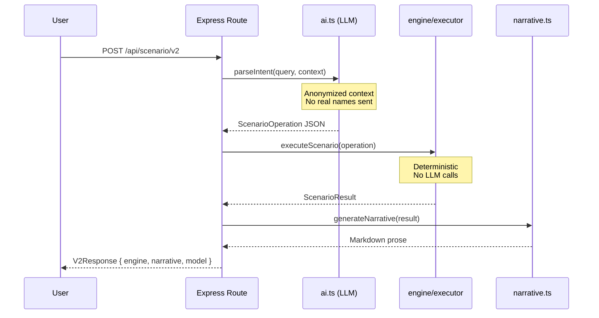
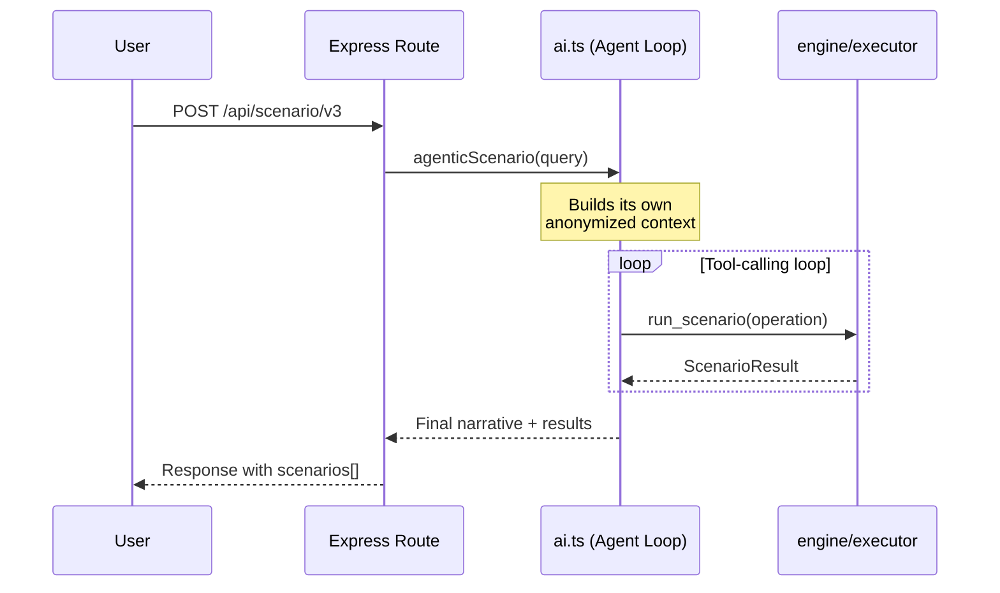

# AI Workflows

The app has two AI-assisted scenario analysis flows, plus a fully deterministic fallback.

In both flows the large language model (LLM) does the language work and nothing else: it reads your plain-English question and decides *what* to compute. The engine then does the computing. Every financial figure in a result is calculated by the engine, never by the model — though with model-written narration enabled the prose describing those figures is the model's own, which is what the advisory faithfulness judge checks.

## Scenario Pipeline (V2) {#v2}

The primary scenario path, and a single pass. The model turns your question into a structured operation, the engine computes the result, and the app renders a summary — from a fixed template by default, or from the model if you ask for it.



### Key Guarantees

- **Engine isolation** — `executeScenario()` never calls the LLM
- **Privacy** — Person names replaced with `Staff-N` before any cloud call
- **Determinism** — Same `ScenarioOperation` always produces the same `ScenarioResult`
- **Fallback narrative** — Template-based markdown when LLM narration is disabled

## Agentic Analysis (V3) {#v3}

V3 uses tool-calling: the model is given the engine as a callable tool (`run_scenario`) and decides for itself when to invoke it. That lets it work through several scenarios in one request — compute, read the exact engine numbers back, then decide what to try next — rather than committing to a single operation up front. Every number it reasons over still comes from the engine.



## Parse-Only Mode

For debugging or UX preview, you can parse intent without computing:

::: code-group

```bash [cURL]
curl -X POST http://127.0.0.1:3000/api/scenario/v2/parse-only \
  -H "Content-Type: application/json" \
  -d '{"query": "What if we add 2 QA Engineers to Alpha?"}'
```

```typescript [api.ts]
const result = await runScenarioV2(
  "What if we add 2 QA Engineers to Alpha?",
  true // skipNarrative
);
```

:::

Returns the structured `ScenarioOperation` without executing the engine.

## LLM Providers

| Provider | Config key | Notes |
|----------|-----------|-------|
| GitHub Models API | `github` (default) | Requires PAT with `models:read` scope. Fully retired 2026-07-30. |
| OpenRouter | `openrouter` | Requires an API key (`openrouter_api_key` config key, or `OPENROUTER_API_KEY` env var). No Settings-tab picker yet — configure via `PUT /api/config` (see [Configuration](../reference/configuration.md)). |
| Ollama (local) | `ollama` | No PAT needed; requires running Ollama server |

Switch providers via the **Settings** tab (GitHub Models / Ollama today) or by editing `llm_provider` directly in the config table / via `PUT /api/config` (all three providers).

### Default Models

| Provider | Default model |
|----------|--------------|
| GitHub | `openai/gpt-4.1` |
| OpenRouter | `nvidia/nemotron-3-ultra-550b-a55b:free` |
| Ollama | `llama3.2` |

## Anonymization

Before any context reaches a cloud LLM, `buildAnonymizedContextSnapshot()` in `server/db.ts` strips person names — the only personally identifiable information (PII) in this dataset:

```
Real data:        "Jane Smith — Senior Developer on Alpha"
Anonymized:       "Staff-1 — Senior Developer on Alpha"
```

Project names, role names, and financial figures are preserved — only person names are replaced.

Three call sites build a snapshot, and all three are anonymized: the `POST /api/scenario/v2` and `POST /api/scenario/v2/parse-only` handlers in `server/routes.ts`, and `agenticScenario()` in `server/ai.ts`. Note that `parseIntent()` receives the snapshot as a parameter rather than building one, so auditing this boundary means checking those three sites. See [ADR 003](../decisions/003-pii-anonymization.md) for the full rationale.

This covers what the app reads out of the database. It does not cover a name you type yourself: your query is sent to the provider verbatim, so "remove Jane Smith from Alpha" transmits that name. Use a local provider if names must not leave the machine at all.

::: danger Do Not Modify
The anonymization function is privacy-critical. Do not modify `buildAnonymizedContextSnapshot()` in a way that could leak real names to external APIs.
:::
